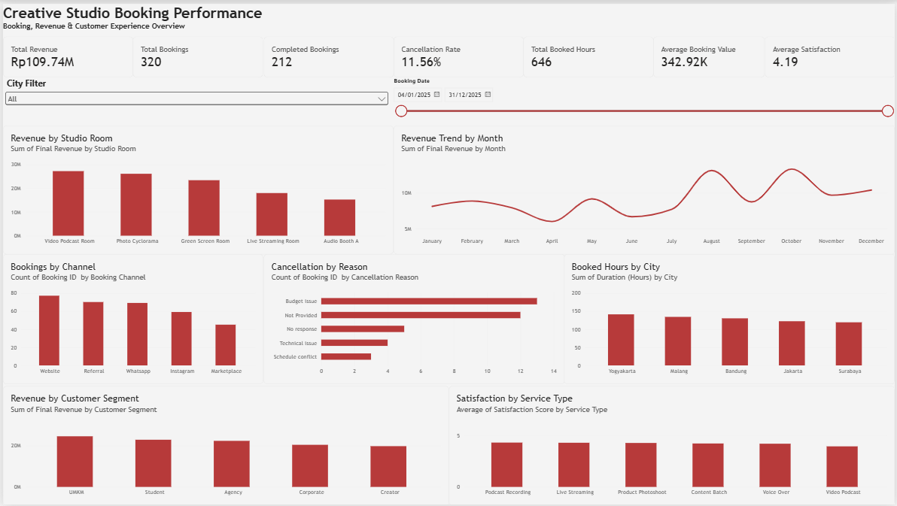

Creative Studio Booking Performance Dashboard

📊 Project Overview

Creative Studio Booking Performance Dashboard is a data analysis and visualization project built to analyze booking performance for a creative studio business.

The project focuses on understanding booking volume, revenue performance, cancellations, studio utilization, customer segments, booking channels, and customer satisfaction.

The workflow covers the complete process from raw data cleaning in Excel to interactive dashboard development in Power BI.

## 📸 Dashboard Preview

🎯 Project Objectives

This project was created to answer key business questions such as:

How much revenue does the studio generate?

How many bookings are recorded?

How many bookings are completed?

What is the cancellation rate?

How many studio hours are booked?

What is the average booking value?

How satisfied are customers?

Which studio rooms and customer segments contribute the most revenue?

Which booking channels generate the most bookings?

What are the main cancellation reasons?

How does revenue change over time?

🛠️ Tools & Technologies

Microsoft Excel — data cleaning, validation, and preparation

Power BI — interactive dashboard and data visualization

DAX — KPI calculations and measures

🧹 Data Preparation

The original dataset contained inconsistent formatting, mixed data types, missing values, and duplicate records.

The data preparation process included:

Standardizing text fields such as city, service type, and booking channel.

Cleaning and standardizing booking dates.

Converting revenue values stored as text into numeric values.

Converting duration and satisfaction values into usable numeric fields.

Identifying duplicate Booking IDs.

Reviewing duplicate records before removal.

Removing 6 exact duplicate booking records.

Handling missing payment methods.

Handling missing satisfaction scores without creating artificial values.

Standardizing cancellation reasons.

Validating data types and business rules.

Creating a clean dataset for Power BI.

The original raw data was preserved separately from the cleaned dataset.

📈 Key Performance Indicators

KPI

Result

Total Revenue

Rp109.74M

Total Bookings

320

Completed Bookings

212

Cancellation Rate

11.56%

Total Booked Hours

646

Average Booking Value

Rp342.92K

Average Satisfaction

4.19 / 5

KPI values represent the cleaned dataset used in the final dashboard.

📊 Dashboard Components

The Power BI dashboard contains the following visualizations:

Revenue Analysis

Revenue by Studio Room

Revenue Trend by Month

Revenue by Customer Segment

Booking Analysis

Total Bookings

Completed Bookings

Bookings by Channel

Booked Hours by City

Cancellation Analysis

Cancellation Rate

Cancellation by Reason

Customer Experience

Average Satisfaction

Satisfaction by Service Type

🔎 Interactive Filters

Users can explore the dashboard using filters for:

Booking Date

City

Studio Room

Service Type

Booking Channel

Customer Segment

Booking Status

These filters allow users to examine booking performance across different business dimensions.

🧮 Example DAX Measure

The cancellation rate was calculated using:

Cancellation Rate =
DIVIDE(
    CALCULATE(
        COUNTROWS('tb1_CreativeStudio'),
        'tb1_CreativeStudio'[Booking Status] = "Cancelled"
    ),
    COUNTROWS('tb1_CreativeStudio'),
    0
)

This measure calculates the proportion of cancelled bookings relative to all bookings in the cleaned dataset.

🔄 Project Workflow

Raw Data
   ↓
Data Cleaning
   ↓
Missing Value Handling
   ↓
Duplicate Detection
   ↓
Data Validation
   ↓
Clean Dataset
   ↓
Power BI
   ↓
DAX Measures
   ↓
Interactive Dashboard

💡 Skills Demonstrated

Excel

Data cleaning

Text standardization

Date transformation

Duplicate detection

Missing-value handling

Data validation

Excel Tables

Formula-based transformation

Power BI

Data import

Data modeling

KPI Cards

Slicers and filters

Column charts

Bar charts

Line charts

Dashboard layout and formatting

DAX

COUNTROWS

CALCULATE

DIVIDE

KPI measure creation

Filter-context handling

📌 Notes

This project uses a simulated creative studio booking dataset for portfolio and learning purposes.

The dashboard is designed to demonstrate an end-to-end data analytics workflow: from raw data preparation to business-oriented visualization and KPI analysis.
